# Reverse Image Search Constructor

## Overview

The **Reverse Image Search Constructor** project demonstrates image similarity search using two advanced techniques: K-Nearest Neighbors (KNN) and Approximate Nearest Neighbors (ANNOY). This project uses the Caltech 101 dataset to extract features from images using the ResNet50 model, and then performs similarity searches to identify and visualize similar images.

## Dataset

### Caltech 101

The Caltech 101 dataset is a well-known benchmark dataset used for object recognition and classification tasks. It consists of images categorized into 101 distinct classes, plus a "BACKGROUND" class containing random images. The dataset is used to test and evaluate image recognition algorithms.

- **Number of Classes**: 101 (excluding the BACKGROUND class)
- **Number of Images**: Approximately 8677 images across all classes
- **Image Types**: Various image types including `.jpg`, `.jpeg`, and `.png`
- **Size and Resolution**: Images are of varying sizes and resolutions

**Note:** In this project, the BACKGROUND class is removed, leaving a clean set of images for training and evaluation.

## Methodologies Used

### Feature Extraction

The ResNet50 model is used to extract features from images. ResNet50 is a deep convolutional neural network that uses residual learning to train very deep networks effectively. It includes:

- **Residual Blocks**: Designed to ease the training of deep networks by allowing gradients to flow through the network via shortcut connections.
- **Convolutional Layers**: Applies various convolutional operations to extract hierarchical features from images.
- **Pooling Layers**: Reduces the spatial dimensions of the feature maps, capturing the most important features.

The ResNet50 model is pre-trained on the ImageNet dataset and is used here to fine-tune on the Caltech 101 dataset with data augmentation, converting images into feature vectors.

### Similarity Search

- **K-Nearest Neighbors (KNN)**: Finds the nearest feature vectors to a query vector using the Euclidean distance metric. Suitable for smaller datasets due to its computational complexity.

- **ANNOY (Approximate Nearest Neighbors Oh Yeah)**: Designed for large datasets, ANNOY constructs a forest of random projection trees to approximate nearest neighbors efficiently, reducing query time.

### Dimensionality Reduction

- **t-SNE (t-Distributed Stochastic Neighbor Embedding)**: This technique is used to project high-dimensional feature vectors into a 2D space for visualization. It helps in understanding the clustering and distribution of images in the feature space.
- **PCA (Principal Component Analysis)**: PCA reduces the dimensionality of the feature vectors before applying KNN and ANNOY, making similarity searches faster and more efficient.

## Similarity Search with KNN

### Nearest neighbors return visually similar images

  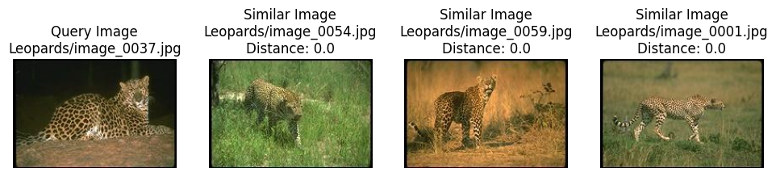
  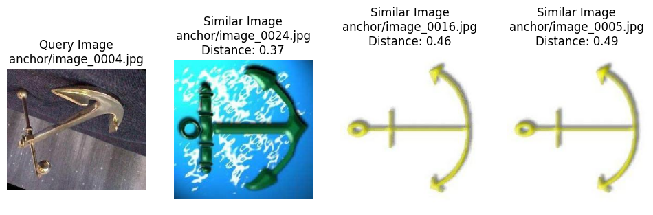
  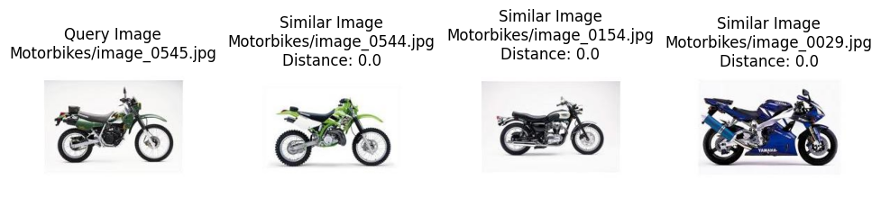
  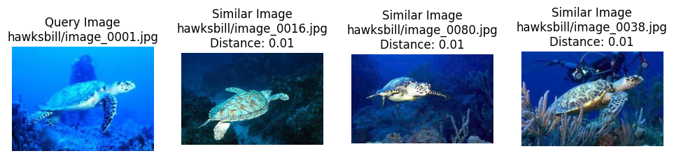
  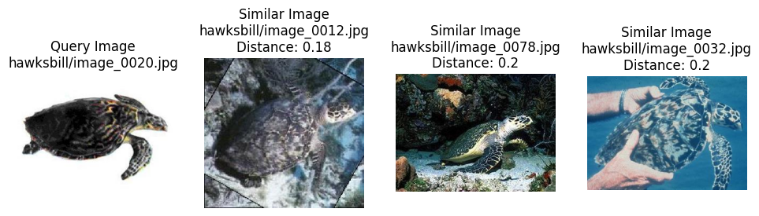
  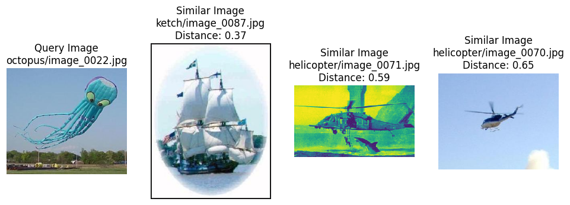  

### t-SNE visualization of image features

  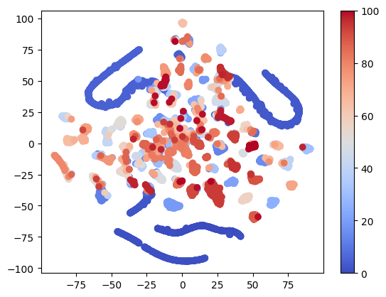

### t-SNE visualization of image clusters

  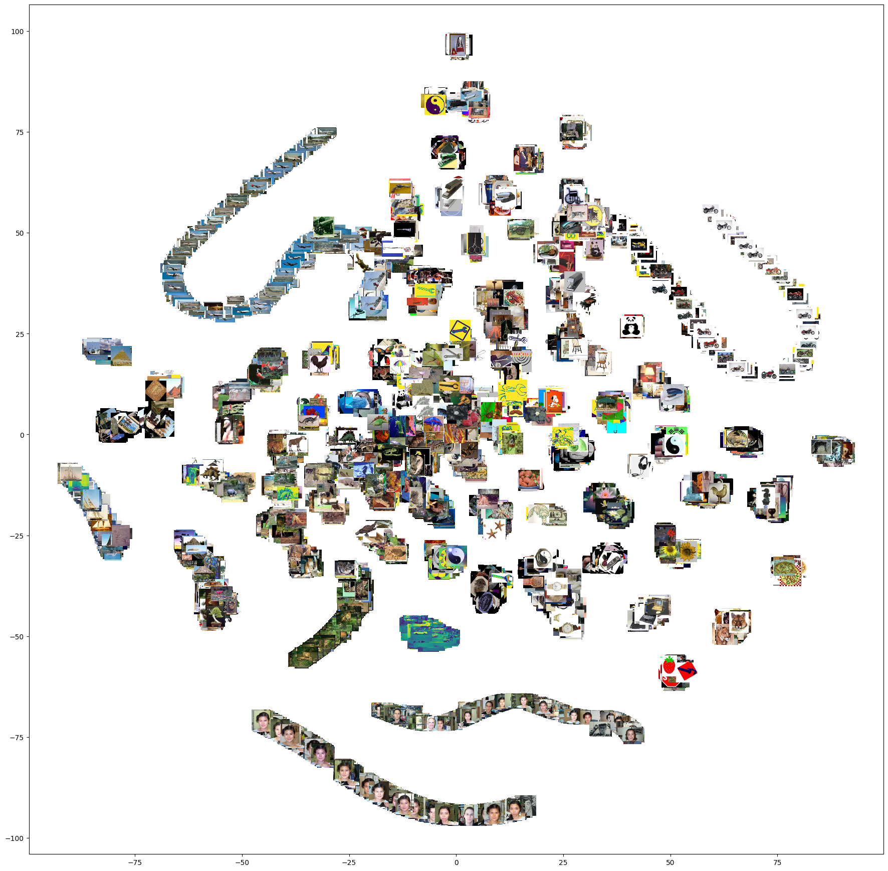

### t-SNE visualization of tiled images

  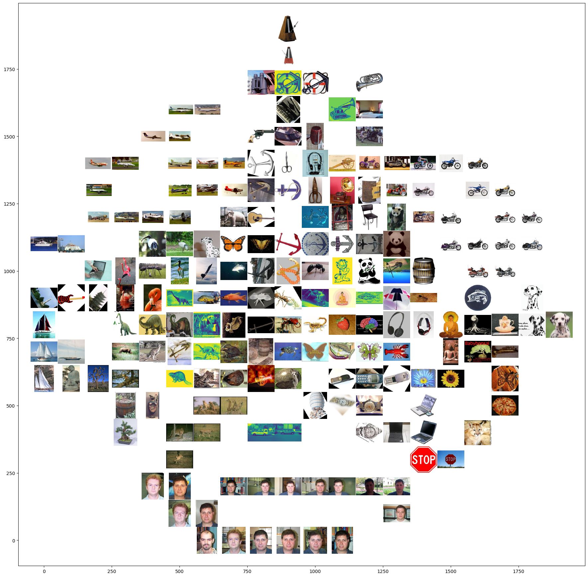

## Similarity Search with KNN with PCA

### Nearest neighbors return visually similar images

  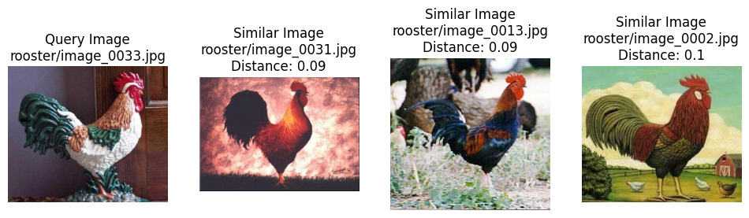
  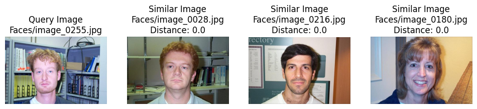
  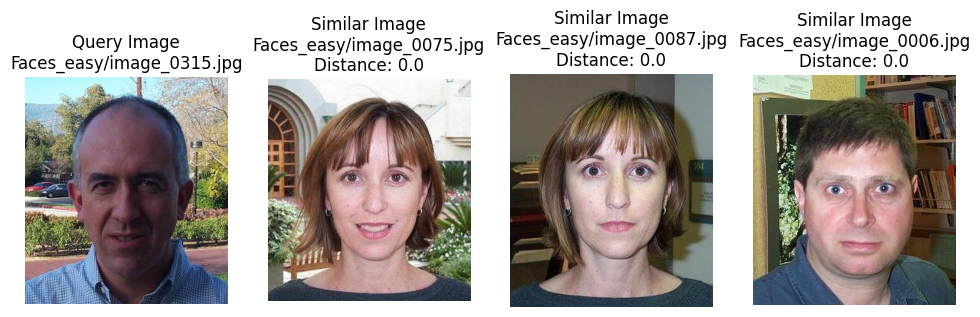
  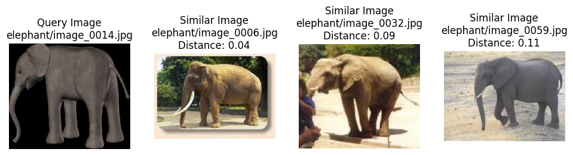
  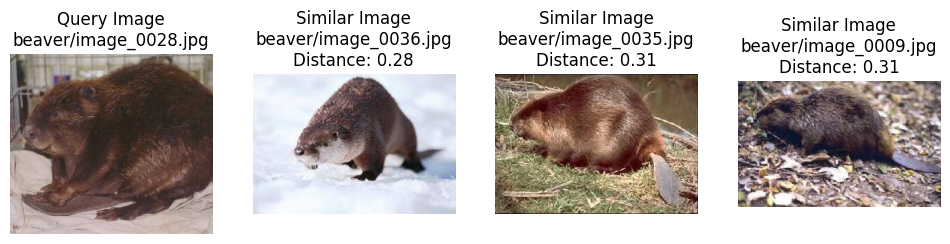
  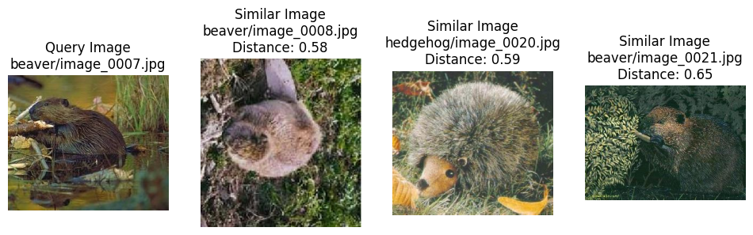  

### t-SNE visualization of image features

  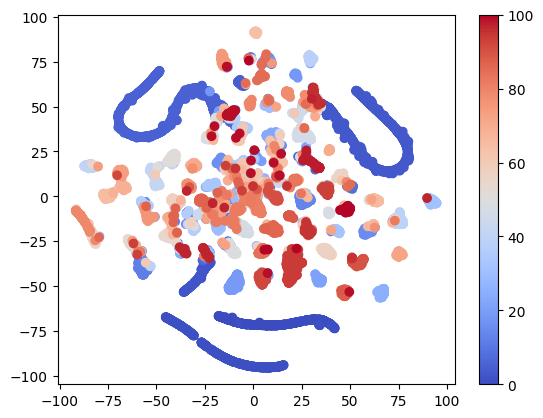

### t-SNE visualization of image clusters

  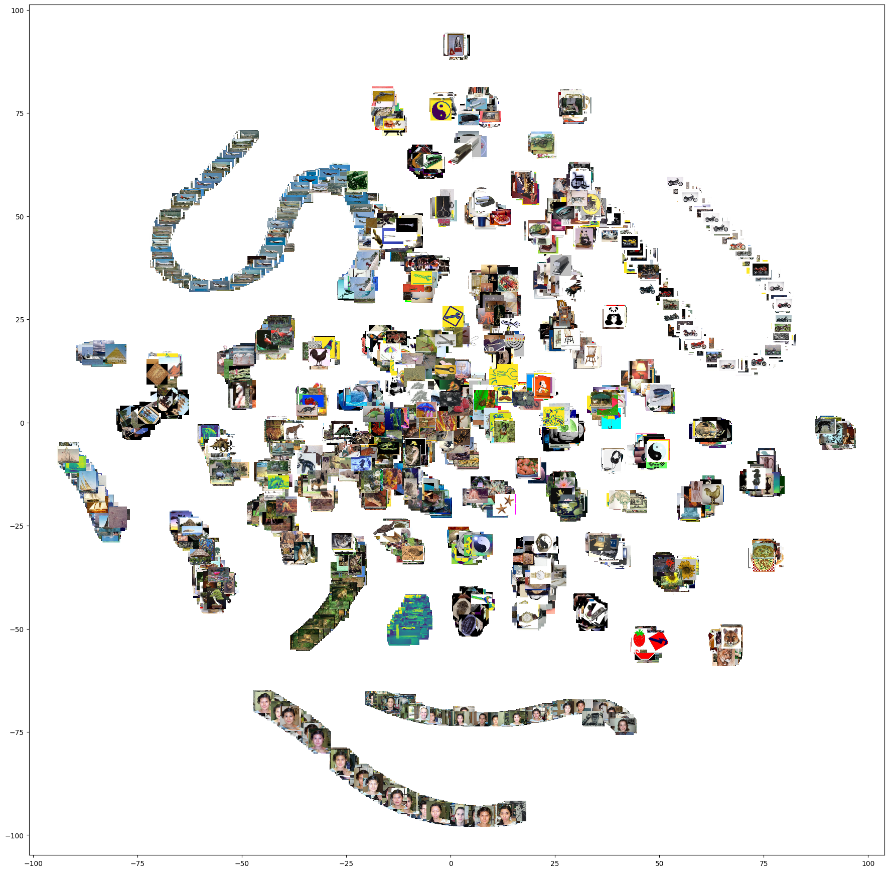

### t-SNE visualization of tiled images

  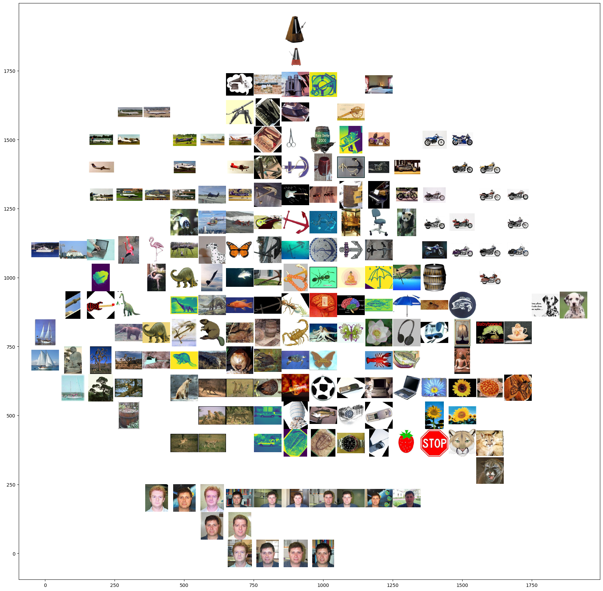

## Similarity Search with ANNOY
### ANNOY returns visually similar images

  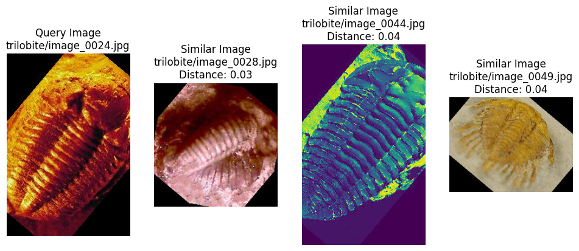
  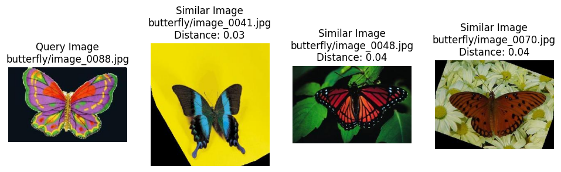
  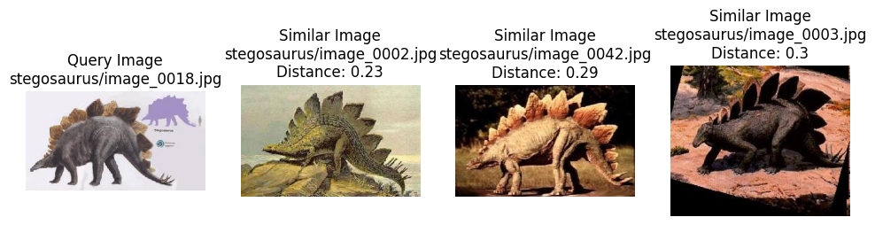
  
  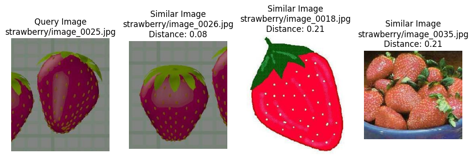
  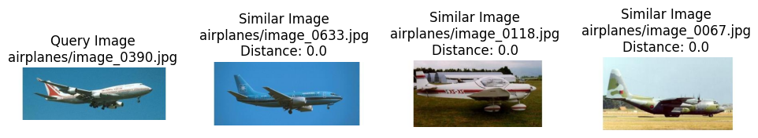  

## Data Sources
https://drive.google.com/uc?id=137RyRjvTBkBiIfeYBNZBtViDHQ6_Ewsp

## License
This project is licensed under the Raza Mehar License. See the LICENSE.md file for details.

## Contact
For any questions or clarifications, please contact Raza Mehar at [raza.mehar@gmail.com].

